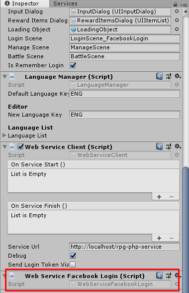
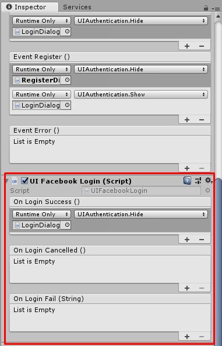
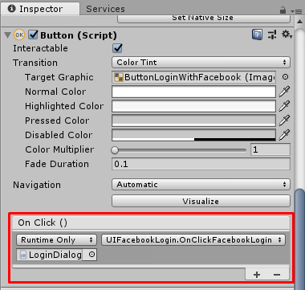

# unity-tbrpg-facebook-login
Facebook Login for Turnbase RPG

## How to setup
* Import Facebook SDK and set App Id [Getting Started](https://developers.facebook.com/docs/unity/gettingstarted/).
* Download and extract files from [the repository](https://github.com/insthync/unity-tbrpg-facebook-login) to your Turnbase RPG project -> Assets folder (You may create subfolder before extracting into it).
* Attach `WebServiceFacebookLogin` component to the same game object which attached `WebServiceClient`.

* Attach `UIFacebookLogin` component to any game object (maybe your login UI root), we will use its function to set to login button,

